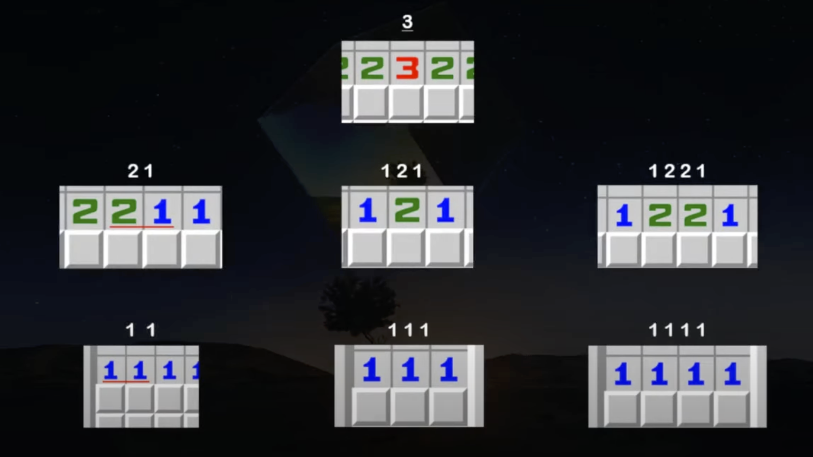

# minesweeper_bot

This is currently a WIP. Here is a demonstration:

https://github.com/tario-you/minesweeper_bot/blob/main/minwaqwwpwe2.mov

The data is gathered through template matching.

My current algorithm consists of

1. if there are x cell unrevealed around a cell with x mines, all of them must be flags
2. if there are x flags around a cell with x mines, all of them can be revealed
3. repeat

However, this algorithm cannot solve the patterns that arise at the end of the video. Thus basic pattern recognition needs to be implemented. These are some basic patterns which can drastically increase the success rate of my bot (credits: https://www.youtube.com/watch?v=6vcSO7h6Nt0&ab_channel=Dard):

